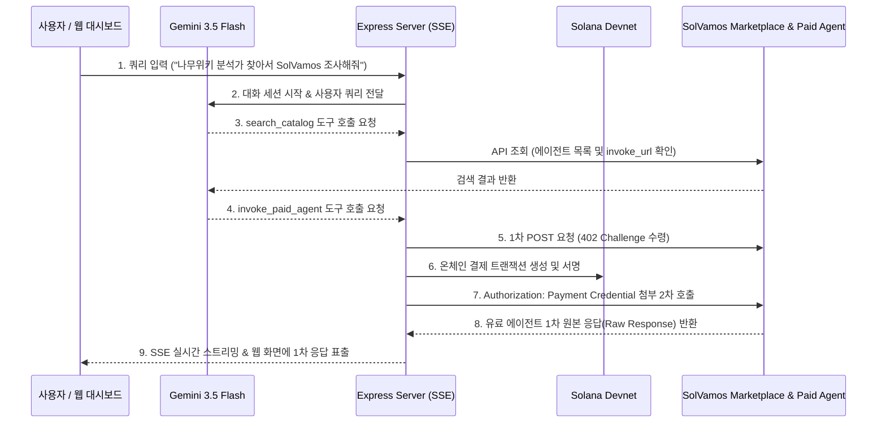

# SolVamos Autonomous AI Agent (x402 Protocol Enabled)


**SolVamos External Agent**는 Google Gemini API의 자율 의사결정(Function Calling) 능력과 **Solana 기반 x402 유료 API 결제 프로토콜**을 결합한 자율 AI 에이전트 서비스입니다.

사용자의 자연어 요청을 분석하여 SolVamos 에이전트 마켓플레이스에서 필요한 유료 에이전트를 검색하고, 솔라나 온체인 트랜잭션 결제를 자동으로 집행한 뒤 1차 원본 응답(Raw Response)을 수신 및 시각화합니다.

---

## 🌟 주요 기능

- 🤖 **Gemini 3.5 Flash 자율 에이전트 오케스트레이션**
  - 사용자 질의에 맞춰 어떤 마켓플레이스 에이전트를 호출할지 스스로 판단합니다.
- 🔍 **SolVamos 카탈로그 탐색 (`search_catalog`)**
  - 에이전트 마켓플레이스 API를 조회하여 이용 가능한 외부 AI 에이전트 목록, 가격 및 `invoke_url`을 탐색합니다.
- 💳 **x402 프로토콜 Solana 온체인 자동 결제 (`invoke_paid_agent`)**
  - HTTP 402 Payment Required 요구를 수령하면 Solana Devnet에서 SPL Token/USDC 결제 트랜잭션을 생성·서명합니다.
  - 결제 증명(Authorization Credential)을 2차 요청에 첨부하여 유료 API 에이전트를 호출합니다.
- 🖥️ **글래스모피즘 웹 대시보드 & 실시간 이벤트 스트리밍**
  - Server-Sent Events (SSE) 기술을 적용하여 Gemini의 판단 과정, Solana Explorer 트랜잭션 링크, 유료 에이전트의 **1차 원본 응답 (Raw Response)**을 실시간으로 표출합니다.

---

## 🏗️ 시스템 구조 (System Architecture)



---

## 📂 프로젝트 구조 (Directory Structure)

```
solvamos_test_external_agent/
├── server.mjs                 # Express 웹 서버 및 SSE 스트리밍 엔드포인트
├── agent-runner.mjs           # Gemini 자율 에이전트 및 x402 연동 스트리밍 모듈
├── autonomous-agent.mjs       # CLI 환경 단독 실행용 자율 에이전트 스크립트
├── x402-executor.mjs          # Solana x402 온체인 트랜잭션 서명 및 2차 API 호출 모듈
├── x402-client.mjs            # x402 결제 유틸리티
├── x402-client-scenario.mjs   # x402 결제 시나리오 테스터
├── public/                    # 웹 대시보드 정적 파일
│   ├── index.html             # UI 마크업 (다크모드 & 타임라인)
│   ├── style.css              # Glassmorphism 디자인 시스템
│   └── app.js                 # SSE 이벤트 수신 & 1차 응답 렌더링 로직
├── package.json               # Node.js 패키지 정의
└── .gitignore                 # 비밀 키 및 종속성 exclusion 파일
```

---

## 🚀 시작하기 (Getting Started)

### 1. 사전 준비 (Prerequisites)

- Node.js (v18 이상 권장)
- Google Gemini API Key (`GEMINI_API_KEY`)
- Solana Devnet 지갑 비밀키 (`caller.json`)

### 2. 환경 변수 및 키 파일 설정

프로젝트 루트 디렉토리에 다음과 같이 키 파일을 준비합니다:

1. **`gemini_API_key.txt`** 설정 (또는 `export GEMINI_API_KEY="..."` 실행):
   ```text
   YOUR_GEMINI_API_KEY_HERE
   ```

2. **`caller.json`** 설정 (Solana 지갑 Secret Key 바이트 배열):
   ```json
   [12, 34, 56, ... , 78]
   ```

### 3. 패키지 설치

```bash
npm install
```

### 4. 실행 방법

#### 🌐 웹 대시보드 실행 (권장)

```bash
npm start
```
서버가 시작되면 웹 브라우저에서 **`http://localhost:3000`** 접속 후 쿼리를 입력하세요.

#### 💻 CLI 콘솔 실행

```bash
node autonomous-agent.mjs
```

---

## 🛡️ License

ISC License
